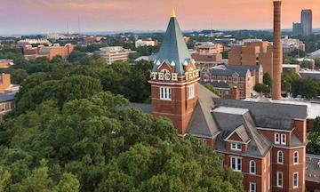
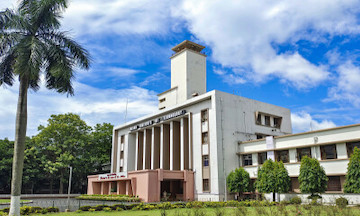

### Hi 👋 , I'm Abhinav Arun ...

Education 👨‍🎓 : 

I completed my Master's in Analytics (Computational Data Track) from Georgia Tech, an institution recognized for its rigorous curriculum and dedication to fostering analytical prowess. I also hold a Bachelor’s Degree in Mechanical Engineering from IIT Kharagpur, one of the most revered engineering institutes in India.

My educational background, underscored by my professional journey, empowers me with a unique confluence of theoretical depth and applied mastery in data science and technology.  

Georgia Tech            |  IIT Kharagpur
:-------------------------:|:-------------------------:
  |  

Awards & Achievements 🎖️ : 

⭐ Regional Runner-up and 14th across the USA in [Purdue Data 4 Good](https://business.purdue.edu/events/data4good/) Hackathon - Generative AI for Extractive Question Answering over medical transcripts and patient-doctor dialogues.   
⭐ Winner of the Generative AI Case Study Challenge at Prudential Financial amongst all Grad Interns.  
⭐ Awarded Leading by Example award in 5 quarters and Champion of the Quarter award in 3 quarters at Innovaccer Inc.  
⭐ Bagged an All India Rank of 1336 and 916 in JEE ADVANCED 2015 and JEE MAINS 2015 respectively - Top 0.1%  
⭐ Recipient of KVPY (Kishore Vaigyanik Protsahan Yojana) Scholarship - 2015  
⭐ Felicitated with Shyamal and Sunanda Ghosh Endownment Scholarship as one of the best incoming sophomore at IIT Kharagpur.  

Experience 👨‍💻 :  

I am currently a **Senior AI Research Scientist at Domyn**, where I work on building **knowledge graph and agentic AI systems over unstructured financial data**. My work focuses on designing scalable pipelines that combine **LLMs, knowledge graphs, and hybrid retrieval architectures** to enable analyst-grade reasoning across financial disclosures and enterprise datasets.

A major part of my work involves building the **Unstructured Data Agent (UDA)** platform and its surrounding application stack.

Key contributions include:

- Developing **FinReflectKG**, an agentic reflection pipeline for constructing high-quality **financial knowledge graphs** from unstructured disclosures using smaller open-source LLMs with evaluation sentinels ensuring reliability and auditability.
- Building an **agentic RAG system** enabling analyst-grade **multihop Q&A across filings and time horizons**, supporting reasoning workflows across companies and financial disclosures.
- Leading the **research and development roadmap for the Unstructured Data Agent (UDA)**, coordinating a global team of researchers and engineers to build production-grade KG-driven agentic systems.
- Delivering a **semantic alignment crosswalk pipeline for a large custodian bank**, mapping vendor feeds with internal systems to create a knowledge graph based **data readiness layer** powering downstream agentic workflows.

Previously, I was a **Senior Data Scientist at Prudential Financial** within its Chief Data Office. 
I worked on projects centered around the applications of **Generative AI (LLMs, LMMs), Graph ML & other ML Models** catered towards adding business value to the corporate function division, primarily around enterprise and HR operations. 
I have experience building & deploying **Gen AI applications at scale**.

Relevant Tech-Stack:  

- AWS (Bedrock, Lex, SageMaker, Comprehend, Kendra)
- LLMs (Azure Open AI GPT-4, Llama-2, Titan, Claude, etc.), RAG based applications (Reranker, RAGAS), Agents, Multimodality
- Streamlit, Docker, LangChain, Llamaindex, OpenSearch
- Python, SQL, Cypher
- Neo4J, Visual Studio Code, BitBucker, JIRA

I possess a multifaceted portfolio of Data Science experience that encompasses a diverse spectrum of domains, ranging from Recommender Systems, Natural Language Processing (NLP), Graph Machine Learning, and experimental design to Statistical modeling (Bayesian vs frequentist) and more.

I did my Internship at Prudential Financial in their Chief Data Office as a Graduate Data Science Intern. I worked on a project centered around exploring the synergies between **Graph machine learning and NLP**, which led to the development of a **knowledge graph system over unstructured data**.

In my previous role as a **Senior Data Associate at Innovaccer Inc.**, a leading healthcare analytics company in Silicon Valley, I gained over three years of experience developing data-driven solutions for healthcare systems and provider groups. My work involved creating scalable machine learning systems including readmission prediction models and value based care for post-acute networks.

Papers (arXiv) 📑 :  

- [FinReflectKG: Agentic Construction and Evaluation of Financial Knowledge Graphs (ICAIF 2025)](https://arxiv.org/pdf/2508.17906)
- [FinReflectKG - MultiHop: Financial QA Benchmark for Reasoning with Knowledge Graph Evidence](https://arxiv.org/pdf/2510.02906)
- [FinReflectKG - EvalBench: Benchmarking Financial KG with Multi-Dimensional Evaluation](https://arxiv.org/pdf/2510.05710)
- [FinCARE: Financial Causal Analysis with Reasoning and Evidence](https://arxiv.org/pdf/2510.20221)
- [Numerical Reasoning on Financial Reports with LLMs](https://arxiv.org/abs/2312.14870)
- [Towards a unified Multimodal Reasoning Framework](https://drive.google.com/file/d/1ucWRiygmGxjkWcdiS9r_ONUsB85xmEhx/view)

Projects :  

- [SmartChoice: Tailoring User Experiences with Advanced Session-Based AI Recommendations](https://drive.google.com/file/d/1dtPf1qYrzMrQ6LX7SQFCh6zLLH80iBYs/view)
- [RoboChef: Revolutionizing Meal Choices with AI-Powered Image Recognition and Personalized Recommendations](https://drive.google.com/file/d/1MuCwT6zBzeMwR-9yYM7ZqBw08euFJ0Zk/view?usp=sharing)
- [Spotify Music Popularity Analysis: Regression for unveiling the Dynamics of Song Traction](https://drive.google.com/file/d/1-l9m0j9dSwLg8QdJuS1gAsCnRChfjg1O/view?usp=sharing)
- [SuperMarket Sweep Problem using a variant of Traveling Salesman optimization problem](https://docs.google.com/presentation/d/1XPx0Yjkwy-L9ZWGLJVWnSNHsOF_TWcSi/edit?usp=sharing&ouid=108253324290053090647&rtpof=true&sd=true)
- [Knowledge Distillation using Replication of Stanford Alpaca Paper using QLoRA](https://drive.google.com/drive/folders/1LsUd_CMBpL2M8vjaW80wphbH0fJV3HI9?usp=drive_link)

Now on to the fun part 😃  

Hobbies ⚽ 🚄 :  

I am a big sports buff and I enjoy playing and watching various sports like Soccer, Tennis, Cricket, etc. 
I'm a passionate enthusiast for global exploration, endlessly intrigued by the stories, customs, and culinary delights that define each country's unique identity. 

I'm an enthusiastic devotee of tech and entrepreneurial podcasts that illuminate the art of value creation in business.
